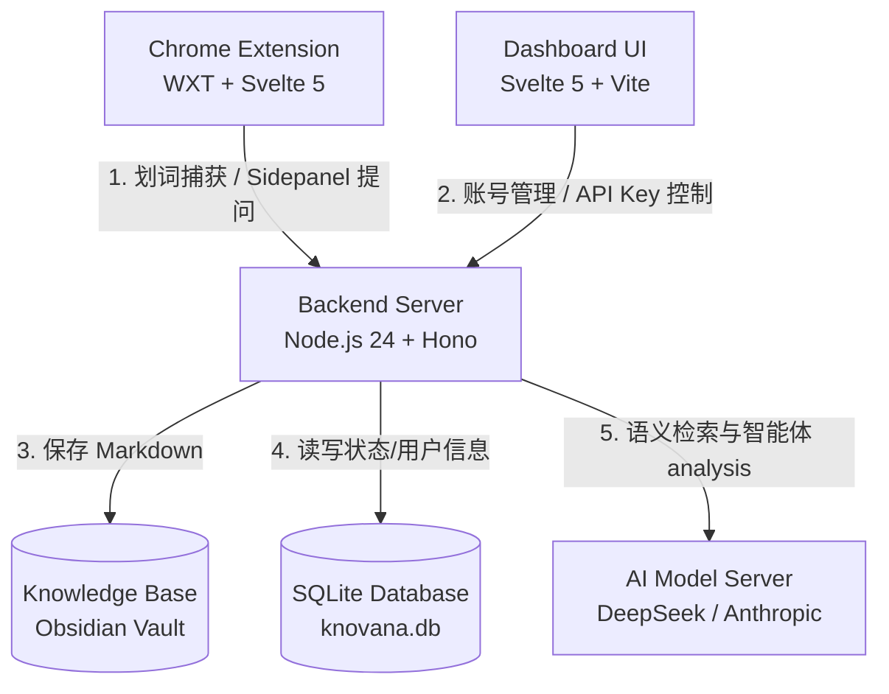

# Knovana (知识星云)

Knovana 是一款将浏览器摘录、内容捕获与个人知识库（如 Obsidian 库）无缝连接的智能体驱动知识系统。

它可以通过浏览器插件在浏览网页时实时捕捉、整理网页和划词内容，将其与本地基于 Markdown 的 Obsidian 知识库同步，并利用内置的大语言模型（LLM）智能体在 Chrome 侧边栏进行深度的个人知识查询。

---

## 1. 系统架构与主要组成部分

Knovana 采用三层模块化设计，如下图所示：



### 模块介绍

1. **`backend` (后端服务)**: 
   基于 Node.js 24 + TypeScript + Hono 构建的高性能轻量后端。集成 SQLite 数据库管理用户注册和 API 授权，使用 `@anthropic-ai/claude-agent-sdk` 对接大语言模型实现 RAG 和智能体提问，支持 Obsidian Vault 的 Markdown 格式写入。
2. **`dashboard` (控制台前端)**: 
   基于 Svelte 5 + Vite 构建的单页应用（SPA）。采用 Premium Paper-like (复古纸质感) 视觉设计，用于管理账户注册、激活审批（管理员视角）、API 密钥管理及直接查阅知识库。
3. **`chrome-extension` (浏览器插件)**: 
   基于 WXT (Web Extension Framework) + Svelte 5 构建的 MV3 浏览器扩展。提供右键菜单和侧边栏（Side Panel）交互，支持对网页文字的高亮摘录、页面剪辑，并支持在侧边栏直接向个人知识库发起提问。

---

## 2. 本地开发运行指南

要在本地进行开发和调试，首先请确保本地已安装 **Node.js (>= 20)** 和 **pnpm**。本地开发支持 Linux、macOS 和 Windows。

### 2.1 依赖安装

在 `backend/` 目录下执行一次依赖安装即可，这会自动触发 Svelte 依赖的安装：
```bash
cd backend
pnpm install
```

### 2.2 配置本地环境变量

进入 `backend` 目录，复制 `.env.example` 并重命名为 `.env`：
```bash
cp .env.example .env
```
主要需要配置 `ANTHROPIC_AUTH_TOKEN`（即您的 API 密钥）以及默认的管理员用户名和密码。

### 2.3 开发模式并行启动

1. **启动后端服务**（监听 `http://localhost:8000`）:
   ```bash
   cd backend
   pnpm dev
   ```
   *注：启动时后端会自动执行数据库 Migrations，并在 `backend/data/knovana.db` 生成 SQLite 数据库。*

2. **启动控制台前端**（监听 `http://localhost:5173`）:
   ```bash
   cd dashboard
   pnpm dev
   ```
   *Vite 开发服务器拥有热重载功能。前端 API 网络库会自动根据开发环境模式将请求转发给运行在 8000 端口的后端服务，无需手动修改请求路径。*

3. **启动浏览器插件调试** (自动生成 `.output/chrome-mv3` 产物):
   ```bash
   cd chrome-extension
   pnpm dev
   ```
   - 打开 Chrome 浏览器，访问 `chrome://extensions/`。
   - 开启右上角“开发者模式”。
   - 点击“加载已解压的扩展程序”，选择 `chrome-extension/.output/chrome-mv3` 文件夹。

### 2.4 编译与打包

- **一键打包后端与控制台** (推荐):
  在 `backend` 目录下运行 `pnpm build`。该脚本会自动先编译控制台 SPA 写入 `backend/public/dashboard`，再编译后端源码至 `backend/dist`。
- **编译与打包浏览器插件 (Chrome Extension)**:
  进入 `chrome-extension` 目录并执行编译指令：
  ```bash
  cd chrome-extension
  pnpm build
  ```
  编译完成后的生产环境产物会输出至 `chrome-extension/.output/chrome-mv3` 文件夹中。您可以直接在 Chrome 的“加载已解压的扩展程序”中选择该目录。
  
  如需将其打包成可分发的 `.zip` 压缩包，可以运行：
  ```bash
  pnpm zip
  ```

---

## 3. 生产环境 Docker Compose 运行指南

在生产环境下，Knovana 暂定系统运行环境为 **Linux**。系统提供了基于 Docker Compose 的一键容器化部署方案。无需在宿主机安装 Node.js 或 pnpm，即可拉起完整的后端服务和控制台界面。

### 3.1 准备配置文件

1. 在项目根目录下，将 `.env.example` 复制一份并重命名为 `.env`：
   ```bash
   cp .env.example .env
   ```
2. 编辑根目录下的 `.env`，修改以下几项关键配置：
   - **`KNOVANA_JWT_SECRET`**: 设置为高强度的随机秘钥（可使用命令 `openssl rand -base64 32` 生成）。
   - **`KNOVANA_ADMIN_USERNAME` 与 `KNOVANA_ADMIN_PASSWORD`**: 修改为您期望的一键初始化管理员账号及密码。
   - **`ANTHROPIC_AUTH_TOKEN`**: 填入您的大模型 API Key。
   - **`ANTHROPIC_BASE_URL`**: 默认已配置为 DeepSeek 兼容的 Endpoint。

### 3.2 一键启动服务

在根目录下运行以下命令，Docker 将读取 `backend/Dockerfile` 并通过多阶段构建自动完成 Dashboard 编译与 Server 打包：

```bash
docker compose up -d --build
```

### 3.3 数据持久化与管理

容器拉起后，会在根目录下自动生成两个用于数据持久化的相对目录：
- **`./data/`**: 包含 SQLite 数据库文件 `knovana.db`。包含用户账号、访问令牌等重要管理数据。
- **`./knowledge-base/`**: 存储您摘录保存的 Markdown 笔记文件。您可以在宿主机中直接使用 Obsidian 将此文件夹打开为一个 Vault，进行可视化整理或与移动端同步。

### 3.4 连通性测试

- 访问 **控制台 UI**: 打开浏览器访问 `http://localhost:8000/dashboard/`
- 访问 **Swagger 交互文档**: 打开浏览器访问 `http://localhost:8000/api/v1/docs`

---

## 4. 提交前与质量检查命令

为了保证代码仓库质量，在提交 Git 变更前，建议在对应模块执行以下命令进行自检：

### 4.1 后端服务 (`backend`)
```bash
pnpm test       # 运行 vitest 单元和集成测试
pnpm check      # TS 静态类型检查
pnpm format     # 自动代码格式化
pnpm lint       # Prettier 检查 + Eslint 静态扫描
```

### 4.2 控制台前端 (`dashboard`)
```bash
pnpm check      # Svelte 5 Runes 和 TS 类型检查
```

### 4.3 浏览器插件 (`chrome-extension`)
```bash
pnpm test:unit  # 运行单元测试
pnpm format     # 格式化插件代码
pnpm lint       # Eslint 与 Prettier 校验
pnpm check      # Svelte 类型检查
pnpm build      # 生产环境编译测试
```
